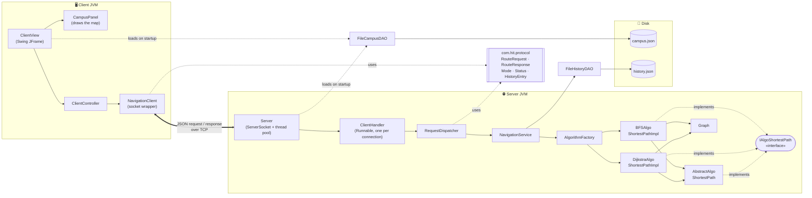

# HIT Campus Navigation

> Course project for **Advanced Programming in Java (PITI)** at HIT — Holon Institute of Technology, Semester B 2026, lecturer Nissim Brami.

A client/server desktop application that finds routes across the **HIT (Holon Institute of Technology) campus**. The server holds the campus map and runs the shortest-path algorithm; the Swing client lets the user pick two buildings, choose a routing mode, and watch a live walking marker animate along the suggested route on a tiltable 2D ↔ 3D isometric map.

The project demonstrates two implementations of the same `IAlgoShortestPath` interface — **Dijkstra** (weighted, fastest walk) and **BFS** (unweighted, fewest segments) — wired together through the **Strategy** and **Factory** patterns.

### Client highlights

The client offers two switchable views of the campus:

- **Map view (default)** — real OpenStreetMap or Esri satellite imagery rendered by `MapPanel` (powered by [JXMapViewer 2](https://github.com/msteiger/jxmapviewer2), a pure-Swing component). Buildings appear as labelled markers at their real GPS coordinates on the HIT campus; the route is drawn as a red ribbon over the map; an animated walker pulses along the path. Toggle between **Satellite** and **Streets** styles.
- **3D schematic** — `CampusPanel`, a hand-rolled isometric renderer (no external 3D library, pure `Graphics2D`). A tilt slider smoothly morphs the view from flat top-down to classic isometric; buildings are extruded into 3D boxes with shaded faces.

Both views share the same source/destination state and animated walker:

- **Click-to-select** — click a building to set the source (green), click another to set the destination (red), and the client immediately asks the server for a route. Works in either view.
- **Live route animation** — `RouteAnimator` (Swing `Timer`, ~33 fps) walks a marker along the polyline at constant speed and loops by default.
- **Pan / zoom / dropdowns** — drag to pan, scroll wheel to zoom, dropdowns + Find Route + mode radio remain as keyboard fallbacks.

The campus data (`campus.json`) carries both schematic `(x, y)` + `height` (for the 3D view) and `(lat, lon)` (for the real map view), so the same JSON drives both renderings.

---

## Architecture



### Request lifecycle

1. **User clicks Find Route** in `ClientView`.
2. `ClientController` builds a `RouteRequest`, calls `NavigationClient.send` on a background thread.
3. `NavigationClient` opens a TCP socket, writes one JSON line, blocks for the response.
4. On the server, the accept loop in `Server` hands the new connection to a `ClientHandler` worker thread.
5. `ClientHandler` reads the line, passes it to `RequestDispatcher`.
6. The dispatcher decodes the JSON and calls `NavigationService.findRoute`.
7. `NavigationService` translates building names → node ids, asks `AlgorithmFactory` for the right `IAlgoShortestPath` (Dijkstra for `FASTEST`, BFS for `FEWEST_SEGMENTS`), runs it on the campus `Graph`, translates ids back to names, and appends the result to `history.json` via `FileHistoryDAO`.
8. The response goes back through the same layers in reverse and is rendered by `CampusPanel`, which highlights the route on the map.

### Design patterns used

| Pattern | Where |
|---|---|
| **Strategy** | `IAlgoShortestPath` with two interchangeable implementations |
| **Template Method** | `AbstractAlgoShortestPath` shares validation + a default `getPathCost` |
| **Factory** | `AlgorithmFactory` maps `Mode` → algorithm |
| **MVC** | `ClientView` ↔ `ClientController` ↔ `NavigationClient` |
| **DAO** | `ICampusDAO` / `FileCampusDAO`, `IHistoryDAO` / `FileHistoryDAO` |
| **Reactor / Thread pool** | `Server` uses `ExecutorService` to handle concurrent clients |

---

## Project layout

```
PITI - HIT Course/
├── pom.xml                       Maven build, Java 17 target
├── README.md                     this file
├── src/main/java/com/hit/
│   ├── algorithm/                pure algorithm module — reusable
│   │   ├── IAlgoShortestPath.java
│   │   ├── AbstractAlgoShortestPath.java
│   │   ├── Graph.java
│   │   ├── DijkstraAlgoShortestPathImpl.java
│   │   └── BFSAlgoShortestPathImpl.java
│   ├── dm/                       domain model
│   │   ├── Building.java
│   │   ├── Walkway.java
│   │   └── Campus.java
│   ├── dao/                      persistence layer
│   │   ├── ICampusDAO.java
│   │   ├── FileCampusDAO.java
│   │   ├── IHistoryDAO.java
│   │   └── FileHistoryDAO.java
│   ├── protocol/                 wire format shared by client & server
│   │   ├── RouteRequest.java
│   │   ├── RouteResponse.java
│   │   ├── HistoryEntry.java
│   │   ├── Mode.java
│   │   ├── Status.java
│   │   └── ProtocolCodec.java
│   ├── service/                  domain service
│   │   ├── AlgorithmFactory.java
│   │   └── NavigationService.java
│   ├── server/                   server-side networking
│   │   ├── Server.java
│   │   ├── ClientHandler.java
│   │   ├── RequestDispatcher.java
│   │   └── ServerMain.java
│   └── client/                   Swing client
│       ├── ClientMain.java
│       ├── controller/ClientController.java
│       ├── network/NavigationClient.java
│       └── view/
│           ├── ClientView.java          Main JFrame, controls + status bar
│           ├── CampusPanel.java         3D isometric renderer (painter's algo)
│           ├── IsometricProjection.java Pure-math camera (tilt + zoom + pan)
│           └── RouteAnimator.java       Walking-pin Timer animator
├── src/main/resources/
│   └── campus.json               HIT campus (13 buildings, varied heights)
└── src/test/java/com/hit/
    ├── algorithm/IAlgoShortestPathTest.java
    ├── dm/CampusTest.java
    └── service/NavigationServiceTest.java
```

---

## Build & run

### Prerequisites

- **JDK 17 or newer** (project compiled with Java 25, targets Java 17 bytecode)
- **Maven 3.9+**

Verify with:

```bash
mvn -version
```

### Compile and test

```bash
mvn clean test
```

You should see all JUnit tests pass (algorithm, domain, and service-layer tests).

### Run the server

In one terminal:

```bash
mvn exec:java@server
```

The server logs `listening on port 8080` and waits.

Optional arguments: `-Dexec.args="<port> <campus.json> <history.json>"`.

### Run the client

In a second terminal:

```bash
mvn exec:java@client
```

A Swing window opens. Pick a source and destination, choose a routing mode, click **Find Route**. The chosen path is highlighted on the map and recorded to `data/history.json` on the server side.

---

## Wire protocol

Single-shot JSON over TCP, one line per message.

**Request** (`RouteRequest`):
```json
{ "type": "ROUTE", "fromBuilding": "MainGate", "toBuilding": "Library", "mode": "FASTEST" }
```

**Response** (`RouteResponse`):
```json
{ "status": "OK", "path": ["MainGate", "Library"], "cost": 60.0, "errorMessage": null }
```

`status` is one of `OK`, `NO_PATH`, `BAD_REQUEST`, `SERVER_ERROR`.

---

## Persistence

- **`src/main/resources/campus.json`** — source of truth for the campus map. Edit to add/remove buildings or walkways.
- **`data/history.json`** — append-only log of every successful route lookup, written by the server. Created on first request. Format is a JSON array of `HistoryEntry` records (timestamp, from, to, mode, path, cost).

---

## Roadmap

- [x] Milestone 1 — Algorithm module + JUnit tests
- [ ] Milestone 2 — Server + client + protocol working end-to-end
- [ ] Milestone 3 — Polish, demo data, error handling
- [ ] Milestone 4 — Final defense (architecture deck + demo video)
